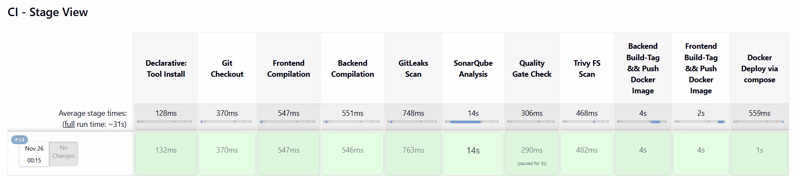
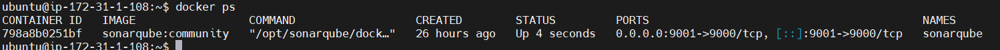
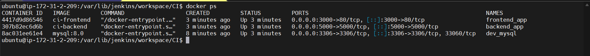

# DevSecOps Pipeline Configuration & Execution Guide

This guide explains how to configure and run the complete DevSecOps CI/CD pipeline for the 3-Tier application.

## Table of Contents
- [Pipeline Overview](#pipeline-overview)
- [Prerequisites](#prerequisites)
- [Pipeline Configuration](#pipeline-configuration)
- [Creating the Jenkins Pipeline](#creating-the-jenkins-pipeline)
- [Pipeline Stages Explained](#pipeline-stages-explained)
- [Running the Pipeline](#running-the-pipeline)
- [Monitoring and Reports](#monitoring-and-reports)
- [Troubleshooting](#troubleshooting)

---

## Pipeline Overview

This DevSecOps pipeline implements a comprehensive security-focused CI/CD workflow with the following stages:

1. **Git Checkout** - Clone repository
2. **Frontend Compilation** - Validate React code syntax
3. **Backend Compilation** - Validate Node.js code syntax
4. **GitLeaks Scan** - Detect secrets and credentials
5. **SonarQube Analysis** - Code quality and security analysis
6. **Quality Gate Check** - Enforce quality standards
7. **Trivy FS Scan** - Filesystem security scan
8. **Backend Docker Build & Scan** - Build and scan API image
9. **Frontend Docker Build & Scan** - Build and scan Client image
10. **Docker Deploy** - Deploy using Docker Compose



---

## Prerequisites

Before running the pipeline, ensure you have completed:

1. ✅ Jenkins installation and configuration ([SETUP.md](./SETUP.md))
2. ✅ SonarQube setup and running ([SETUP.md](./SETUP.md))
3. ✅ All required tools installed:
   - NodeJS
   - Docker
   - Docker Compose
   - GitLeaks
   - Trivy
4. ✅ Jenkins plugins installed
5. ✅ Credentials configured in Jenkins:
   - Docker Hub credentials (ID: `docker-cred`)
   - SonarQube token (ID: `sonar-token`)

---

## Pipeline Configuration

### 1. Update Jenkinsfile Repository URL

Update the Git repository URL in `JenkinsFile` to match your repository:

```groovy
stage('Git Checkout') {
    steps {
        git branch: 'main', url: 'https://github.com/YOUR_USERNAME/YOUR_REPO.git'
    }
}
```

**Current configuration:**
- Branch: `docker-build-deploy`
- URL: `https://github.com/Rahuldubey2629/DevSecOps-Learning.git`

**Change to your repository details.**

### 2. Update Docker Hub Username

In `JenkinsFile`, update the Docker Hub username in the following stages:

```groovy
// Backend image
sh "docker build -t YOUR_DOCKERHUB_USERNAME/devsecops-backend:latest . "
sh "trivy image --format table -o backend-scan-report.html YOUR_DOCKERHUB_USERNAME/devsecops-backend:latest"
sh "docker push YOUR_DOCKERHUB_USERNAME/devsecops-backend:latest "

// Frontend image
sh "docker build -t YOUR_DOCKERHUB_USERNAME/devsecops-frontend:latest ."
sh "trivy image --format table -o frontend-scan-report.html YOUR_DOCKERHUB_USERNAME/devsecops-frontend:latest"
sh "docker push YOUR_DOCKERHUB_USERNAME/devsecops-frontend:latest "
```

**Current username:** `rahuldubey1`  
**Change to:** Your Docker Hub username

### 3. Update Docker Compose Configuration

Update `docker-compose.yml` with your Docker images:

```yaml
services:
  api:
    image: YOUR_DOCKERHUB_USERNAME/devsecops-backend:latest
    # ... rest of configuration

  client:
    image: YOUR_DOCKERHUB_USERNAME/devsecops-frontend:latest
    # ... rest of configuration
```

### 4. SonarQube Project Configuration

The pipeline uses the following SonarQube configuration:

```groovy
sh ''' $SCANNER_HOME/bin/sonar-scanner -Dsonar.projectName=NodeJS-Project \
        -Dsonar.projectKey=NodeJS-Project '''
```

**To customize:**
- Change `NodeJS-Project` to your preferred project name/key
- Ensure the project key matches in both Jenkinsfile and SonarQube

### 5. Environment-Specific Configuration

Create a `.env` file in the project root if needed for environment variables:

```bash
# Database Configuration
DB_HOST=mysql
DB_USER=root
DB_PASSWORD=Admin@123
DB_NAME=userdb

# API Configuration
API_PORT=5000
JWT_SECRET=your-secret-key

# Client Configuration
REACT_APP_API_URL=http://localhost:5000
```

---

## Creating the Jenkins Pipeline

### Step 1: Create New Pipeline Job

1. Open Jenkins dashboard
2. Click **New Item**
3. Enter item name: `DevSecOps-3Tier-Pipeline`
4. Select **Pipeline**
5. Click **OK**

### Step 2: Configure Pipeline

#### General Settings
- ✓ Check **GitHub project** (optional)
- Project URL: `https://github.com/YOUR_USERNAME/YOUR_REPO/`

#### Build Triggers
Choose one or more:
- ✓ **GitHub hook trigger for GITScm polling** (for webhook-based builds)
- ✓ **Poll SCM** (for periodic checks)
  - Schedule: `H/5 * * * *` (every 5 minutes)

#### Pipeline Configuration

Choose **Pipeline script from SCM**:
- **SCM:** Git
- **Repository URL:** `https://github.com/YOUR_USERNAME/YOUR_REPO.git`
- **Credentials:** Add if private repository
- **Branch Specifier:** `*/main` or `*/docker-build-deploy`
- **Script Path:** `JenkinsFile`

OR

Choose **Pipeline script** and paste the Jenkinsfile content directly.

### Step 3: Save Configuration

Click **Save** to create the pipeline.

---

## Pipeline Stages Explained

### Stage 1: Git Checkout
```groovy
stage('Git Checkout') {
    steps {
        git branch: 'docker-build-deploy', url: 'https://github.com/Rahuldubey2629/DevSecOps-Learning.git'
    }
}
```
**Purpose:** Clone the repository and checkout the specified branch  
**Output:** Source code available in Jenkins workspace  
**Duration:** ~5-10 seconds

---

### Stage 2: Frontend Compilation
```groovy
stage('Frontend Compilation') {
    steps {
        dir('client') {
            sh 'find . -name "*.js" -exec node --check {} +'
        }
    }
}
```
**Purpose:** Validate JavaScript syntax in React application  
**What it does:** Checks all `.js` files for syntax errors without executing them  
**Fails if:** Any JavaScript syntax errors found  
**Duration:** ~10-15 seconds

---

### Stage 3: Backend Compilation
```groovy
stage('Backend Compilation') {
    steps {
        dir('api') {
            sh 'find . -name "*.js" -exec node --check {} +'
        }
    }
}
```
**Purpose:** Validate JavaScript syntax in Node.js API  
**What it does:** Checks all `.js` files for syntax errors  
**Fails if:** Any JavaScript syntax errors found  
**Duration:** ~5-10 seconds

---

### Stage 4: GitLeaks Scan
```groovy
stage('GitLeaks Scan') {
    steps {
        sh "gitleaks detect --source ./client --exit-code 1"
        sh "gitleaks detect --source ./api --exit-code 1"
    }
}
```
**Purpose:** Detect hardcoded secrets, API keys, passwords, tokens  
**What it scans:**
- API keys
- Passwords
- Private keys
- Tokens
- Certificates

**Fails if:** Any secrets detected  
**Configuration:** Uses default GitLeaks rules  
**Duration:** ~15-20 seconds

**Common issues detected:**
- AWS keys
- GitHub tokens
- Database passwords
- JWT secrets

---

### Stage 5: SonarQube Analysis
```groovy
stage('SonarQube Analysis') {
    steps {
        withSonarQubeEnv('sonar-server') {
            sh ''' $SCANNER_HOME/bin/sonar-scanner -Dsonar.projectName=NodeJS-Project \
                    -Dsonar.projectKey=NodeJS-Project '''
        }
    }
}
```
**Purpose:** Comprehensive code quality and security analysis  
**What it analyzes:**
- Code smells
- Bugs
- Security vulnerabilities
- Code coverage
- Duplications
- Complexity

**Reports generated:**
- Security hotspots
- Vulnerability report
- Code quality metrics
- Technical debt

**Duration:** ~30-60 seconds  
**Access report:** SonarQube dashboard at `http://localhost:9000`



---

### Stage 6: Quality Gate Check
```groovy
stage('Quality Gate Check') {
    steps {
        timeout(time: 1, unit: 'HOURS') {
            waitForQualityGate abortPipeline: false, credentialsId: 'sonar-token'
        }
    }
}
```
**Purpose:** Enforce quality standards defined in SonarQube  
**What it checks:**
- Code coverage threshold
- Bug threshold
- Vulnerability threshold
- Code smell threshold
- Duplication threshold

**Configuration:** Set in SonarQube → Quality Gates  
**Behavior:** 
- `abortPipeline: false` = Continue even if quality gate fails (warning only)
- `abortPipeline: true` = Stop pipeline if quality gate fails

**Duration:** ~10-30 seconds  
**Timeout:** 1 hour maximum wait time

---

### Stage 7: Trivy FS Scan
```groovy
stage('Trivy FS Scan') {
    steps {
        sh 'trivy fs --format table -o fs-report.html .'
    }
}
```
**Purpose:** Scan filesystem for vulnerabilities in dependencies  
**What it scans:**
- Node.js packages (package.json)
- Known CVEs in dependencies
- Outdated packages
- License issues

**Output:** HTML report `fs-report.html` in workspace  
**Duration:** ~30-45 seconds (first run may take longer)

**Severity levels:**
- CRITICAL
- HIGH
- MEDIUM
- LOW
- UNKNOWN

---

### Stage 8: Backend Build, Scan & Push
```groovy
stage('Backend Build-Tag && Push Docker Image') {
    steps {
        script {
            withDockerRegistry(credentialsId: 'docker-cred') {
                dir("api"){
                    sh "docker build -t rahuldubey1/devsecops-backend:latest . "
                    sh "trivy image --format table -o backend-scan-report.html rahuldubey1/devsecops-backend:latest"
                    sh "docker push rahuldubey1/devsecops-backend:latest "
                }
            }
        }
    }
}
```
**Purpose:** Build, scan, and push backend Docker image  
**Steps:**
1. Build Docker image from `api/Dockerfile`
2. Scan image with Trivy for vulnerabilities
3. Push image to Docker Hub

**What Trivy scans in image:**
- OS packages (Alpine Linux)
- Node.js runtime
- npm packages
- Base image vulnerabilities

**Output:** 
- Docker image: `rahuldubey1/devsecops-backend:latest`
- Scan report: `backend-scan-report.html`

**Duration:** ~2-5 minutes (depends on image size and layers)

---

### Stage 9: Frontend Build, Scan & Push
```groovy
stage('Frontend Build-Tag && Push Docker Image') {
    steps {
        script {
            withDockerRegistry(credentialsId: 'docker-cred') {
                dir("client"){
                    sh "docker build -t rahuldubey1/devsecops-frontend:latest ."
                    sh "trivy image --format table -o frontend-scan-report.html rahuldubey1/devsecops-frontend:latest"
                    sh "docker push rahuldubey1/devsecops-frontend:latest "
                }
            }
        }
    }
}
```
**Purpose:** Build, scan, and push frontend Docker image  
**Steps:**
1. Build React app (npm run build)
2. Create Docker image with Nginx
3. Scan image with Trivy
4. Push to Docker Hub

**Multi-stage build:**
- Stage 1: Build React app with Node.js
- Stage 2: Serve with Nginx

**Output:** 
- Docker image: `rahuldubey1/devsecops-frontend:latest`
- Scan report: `frontend-scan-report.html`

**Duration:** ~3-7 minutes (npm install and build take time)

---

### Stage 10: Docker Deploy via Compose
```groovy
stage('Docker Deploy via compose') {
    steps {
        script {
            sh "docker-compose up -d"
        }
    }
}
```
**Purpose:** Deploy all services using Docker Compose  
**Services deployed:**
- MySQL database (port 3306)
- Backend API (port 5000)
- Frontend client (port 80)

**What happens:**
1. Pull latest images from Docker Hub
2. Create network bridge
3. Start MySQL container
4. Start API container (waits for DB)
5. Start Client container

**Duration:** ~30-60 seconds  
**Verification:** Access `http://localhost` or `http://<server-ip>`

---

## Running the Pipeline

### Method 1: Manual Trigger

1. Go to Jenkins dashboard
2. Click on `DevSecOps-3Tier-Pipeline`
3. Click **Build Now**
4. View progress in **Build History**
5. Click on build number (e.g., #1)
6. Click **Console Output** to view logs

### Method 2: Automatic Trigger (Git Webhook)

#### Configure GitHub Webhook:

1. Go to your GitHub repository
2. Navigate to **Settings** → **Webhooks** → **Add webhook**
3. Configure:
   - **Payload URL:** `http://your-jenkins-url:8080/github-webhook/`
   - **Content type:** `application/json`
   - **Events:** Just the push event
   - **Active:** ✓ Checked
4. Click **Add webhook**

Now the pipeline will trigger automatically on every push to the repository.

### Method 3: Scheduled Builds

Configure in Jenkins job:
- **Build Triggers** → **Poll SCM**
- Schedule: `H/5 * * * *` (every 5 minutes)

---

## Monitoring and Reports

### Jenkins Stage View

View pipeline stages visually:
1. Go to pipeline job
2. Click on latest build
3. View **Stage View** or **Pipeline Steps**


### SonarQube Dashboard

Access detailed code quality reports:
1. Navigate to `http://localhost:9000`
2. Login with credentials
3. Click on **NodeJS-Project**
4. View:
   - Overview
   - Issues (Bugs, Vulnerabilities, Code Smells)
   - Security Hotspots
   - Measures
   - Code


### Trivy Reports

View security scan reports:

**Location:** Jenkins workspace
- `fs-report.html` - Filesystem scan
- `backend-scan-report.html` - Backend image scan
- `frontend-scan-report.html` - Frontend image scan

**To view:**
1. Go to Jenkins job
2. Click on build number
3. Go to **Workspace**
4. Download and open HTML reports

### Docker Container Status

Check running containers:
```bash
docker ps
```

Expected output:
```
CONTAINER ID   IMAGE                                    STATUS    PORTS
xxxxxxxxxxxx   rahuldubey1/devsecops-frontend:latest   Up        0.0.0.0:80->80/tcp
xxxxxxxxxxxx   rahuldubey1/devsecops-backend:latest    Up        0.0.0.0:5000->5000/tcp
xxxxxxxxxxxx   mysql:8.0                                Up        0.0.0.0:3306->3306/tcp
```



### Application Access

After successful deployment:
- **Frontend:** http://localhost or http://your-server-ip
- **Backend API:** http://localhost:5000 or http://your-server-ip:5000
- **MySQL:** localhost:3306

---

## Troubleshooting

### Pipeline Fails at Git Checkout

**Issue:** Cannot clone repository

**Solutions:**
```bash
# Check network connectivity
ping github.com

# Verify repository URL
git ls-remote https://github.com/YOUR_USERNAME/YOUR_REPO.git

# Check Jenkins Git plugin
# Manage Jenkins → Manage Plugins → Installed → Search for "Git"
```

---

### Compilation Stage Fails

**Issue:** JavaScript syntax errors

**Solutions:**
```bash
# Test locally
cd client
find . -name "*.js" -exec node --check {} +

# Fix syntax errors in code
# Common issues: missing brackets, semicolons, wrong imports
```

---

### GitLeaks Scan Fails

**Issue:** Secrets detected in code

**Solutions:**
1. **Identify secrets:**
   ```bash
   gitleaks detect --source ./client --verbose
   gitleaks detect --source ./api --verbose
   ```

2. **Remove secrets:**
   - Move secrets to environment variables
   - Use `.env` files (add to `.gitignore`)
   - Use Jenkins credentials plugin

3. **Example fix:**
   ```javascript
   // BAD
   const DB_PASSWORD = "Admin@123";
   
   // GOOD
   const DB_PASSWORD = process.env.DB_PASSWORD;
   ```

---

### SonarQube Analysis Fails

**Issue:** Cannot connect to SonarQube server

**Solutions:**
```bash
# Check SonarQube is running
docker ps | grep sonarqube
curl http://localhost:9000

# Restart SonarQube
docker restart sonarqube

# Check Jenkins SonarQube configuration
# Manage Jenkins → Configure System → SonarQube servers
```

**Issue:** Project not found

**Solution:** Create project in SonarQube first
1. Login to SonarQube
2. Click **Create Project** → **Manually**
3. Use key: `NodeJS-Project`

---

### Quality Gate Fails

**Issue:** Quality gate threshold not met

**Solutions:**
1. **View issues in SonarQube:**
   - Go to SonarQube dashboard
   - Click on project
   - Review Issues tab

2. **Adjust quality gate (not recommended for production):**
   - SonarQube → Quality Gates → Create custom gate
   - Set appropriate thresholds

3. **Fix code issues:**
   - Address bugs
   - Fix security vulnerabilities
   - Improve code coverage with tests

---

### Trivy Scan Fails

**Issue:** Trivy not installed or database error

**Solutions:**
```bash
# Check Trivy installation
trivy --version

# Update Trivy database
trivy image --download-db-only

# Clear cache and retry
rm -rf ~/.cache/trivy
trivy fs .
```

---

### Docker Build Fails

**Issue:** Dockerfile not found or build errors

**Solutions:**
```bash
# Verify Dockerfile exists
ls -la api/Dockerfile
ls -la client/Dockerfile

# Test build locally
cd api
docker build -t test-api .

cd ../client
docker build -t test-client .

# Check build logs for specific errors
```

**Common issues:**
- Missing dependencies in package.json
- Incorrect COPY paths in Dockerfile
- Network issues during npm install

**Solutions:**
```dockerfile
# Add retry logic for npm install
RUN npm install --production || npm install --production || npm install --production
```

---

### Docker Push Fails

**Issue:** Authentication error or network issues

**Solutions:**
```bash
# Login to Docker Hub from Jenkins server
docker login

# Verify credentials in Jenkins
# Manage Jenkins → Manage Credentials → Check docker-cred

# Test push manually
docker push YOUR_USERNAME/devsecops-backend:latest
```

---

### Docker Compose Deployment Fails

**Issue:** Port conflicts or container startup failures

**Solutions:**
```bash
# Check port availability
sudo netstat -tulpn | grep :80
sudo netstat -tulpn | grep :5000
sudo netstat -tulpn | grep :3306

# Stop existing containers
docker-compose down

# Remove volumes if needed
docker-compose down -v

# Check logs
docker-compose logs api
docker-compose logs client
docker-compose logs mysql

# Restart services
docker-compose up -d

# Check container health
docker ps -a
```

---

### Application Not Accessible

**Issue:** Cannot access frontend or backend

**Solutions:**
```bash
# Check containers are running
docker ps

# Check container logs
docker logs <container-name>

# Verify network
docker network ls
docker network inspect <network-name>

# Test backend API
curl http://localhost:5000/health

# Check frontend
curl http://localhost

# Verify MySQL connection
docker exec -it <mysql-container> mysql -u root -p
```

---

## Pipeline Best Practices

### 1. Secret Management
- ✅ Use Jenkins Credentials Plugin
- ✅ Use environment variables
- ✅ Never commit secrets to Git
- ✅ Use `.env` files (gitignored)

### 2. Image Tagging Strategy
```groovy
// Instead of :latest, use versioning
sh "docker build -t username/app:v1.0.${BUILD_NUMBER} ."
sh "docker push username/app:v1.0.${BUILD_NUMBER}"
```

### 3. Cleanup Old Images
Add cleanup stage:
```groovy
stage('Cleanup') {
    steps {
        sh 'docker system prune -af --volumes'
    }
}
```

### 4. Parallel Execution
Speed up pipeline:
```groovy
stage('Parallel Scans') {
    parallel {
        stage('GitLeaks') { steps { sh 'gitleaks detect' } }
        stage('Trivy FS') { steps { sh 'trivy fs .' } }
    }
}
```

### 5. Notifications
Add email/Slack notifications:
```groovy
post {
    success {
        echo 'Pipeline succeeded!'
        // Add notification here
    }
    failure {
        echo 'Pipeline failed!'
        // Add notification here
    }
}
```

---

## Performance Optimization

### Speed up Docker builds:
1. Use `.dockerignore` files
2. Leverage build cache
3. Use multi-stage builds
4. Minimize layers

### Speed up npm installs:
```dockerfile
# Use npm ci instead of npm install
RUN npm ci --production

# Or use npm cache
RUN npm install --prefer-offline --no-audit --production
```

### Speed up Trivy scans:
```bash
# Download database once
trivy image --download-db-only

# Use light mode
trivy image --severity HIGH,CRITICAL
```

---

## Security Considerations

### 1. Container Security
- Use official base images
- Regularly update base images
- Run containers as non-root user
- Scan images before deployment

### 2. Network Security
- Use Docker networks for isolation
- Expose only necessary ports
- Use reverse proxy (Nginx) for frontend

### 3. Database Security
- Use strong passwords
- Limit database user privileges
- Use environment variables for credentials
- Enable SSL for database connections

### 4. API Security
- Implement rate limiting
- Use JWT with short expiration
- Validate all inputs
- Enable CORS properly

---

## Next Steps

1. ✅ Monitor pipeline executions
2. ✅ Review SonarQube reports regularly
3. ✅ Address security vulnerabilities found by Trivy
4. ✅ Implement automated testing (unit, integration)
5. ✅ Set up monitoring (Prometheus, Grafana)
6. ✅ Implement log aggregation (ELK stack)
7. ✅ Consider Kubernetes deployment for production

---

## Additional Resources

- [Jenkins Documentation](https://www.jenkins.io/doc/)
- [SonarQube Documentation](https://docs.sonarqube.org/)
- [Docker Documentation](https://docs.docker.com/)
- [Trivy Documentation](https://aquasecurity.github.io/trivy/)
- [GitLeaks Documentation](https://github.com/gitleaks/gitleaks)

---

## Support

For issues or questions:
1. Check this guide's troubleshooting section
2. Review Jenkins console output
3. Check SonarQube dashboard for code issues
4. Review Trivy reports for security vulnerabilities
5. Consult official documentation for specific tools

---

**Happy DevSecOps! 🚀🔒**
